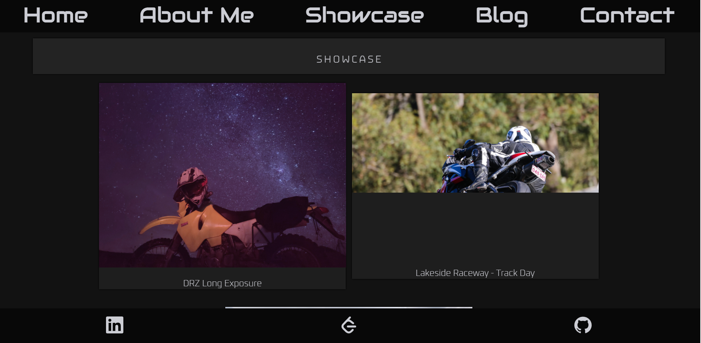
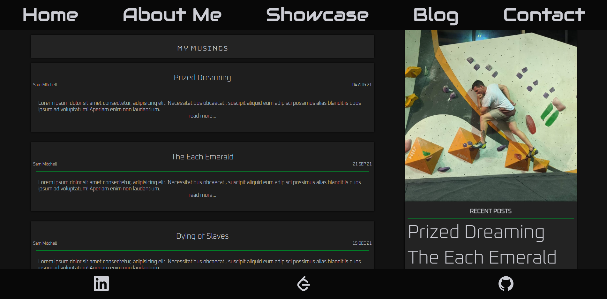
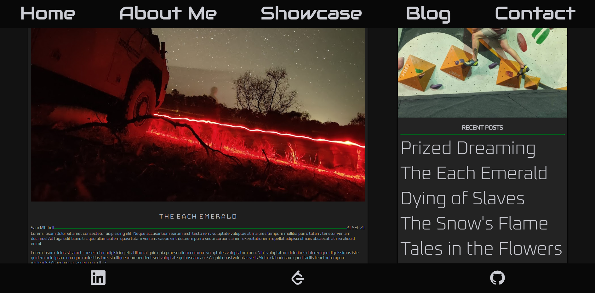
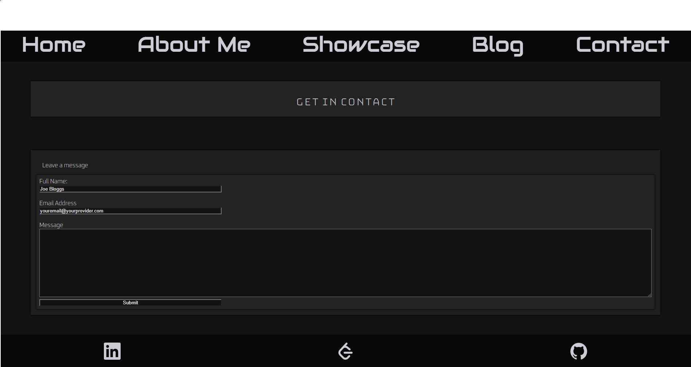

# T1A2 - Porfolio - Sam Mitchell

Portfolio Available [Here](xxvii.dev)  
Git Repository Available [Here](github.com/samworth27/portfolio)

## Purpose:
Purpose of this website is to provide potential employers information in regards to my skills and to give a brief overview of my personality in order for them to assess my suitablility to work within one of their teams

## Functionality/ Features:
The site is currently a responsive static website. The website was designed in regards to the mobile first principles.
The site currently features a static blog

##  Sitemap:
 - Index
 - About Me
 - Showcase
 - Blog
   - Blog Post [1 - n]
 - Contact Me

## Target Audience:
```
The target audience for the portfolio website is an employer 
looking to engage a dev and/or IT professional. Expect the
employer to have the following knowledge and expectations:

Technical knowledge relating to information technology, 
software development/coding, programming languages and development stacks
high expectations of professionalism and a positive work ethic
```

## Stack
 - HTML
 - CSS
 - JS

## Images

### Landing Page:
Contains a link to my resume in the profile card


### About Me:
Roughly stylised as a dossier


### Showcase:
Uses Flip cards to enable maximun space for both image and text content on small devices



### Blog Main

Contains snippets of posts and a list of recent blog posts



#### Blog Post

Contains full blog article



## Contact Page
Contains a webform to submit a message to allow interested persons to get in contact without exposing my email address


